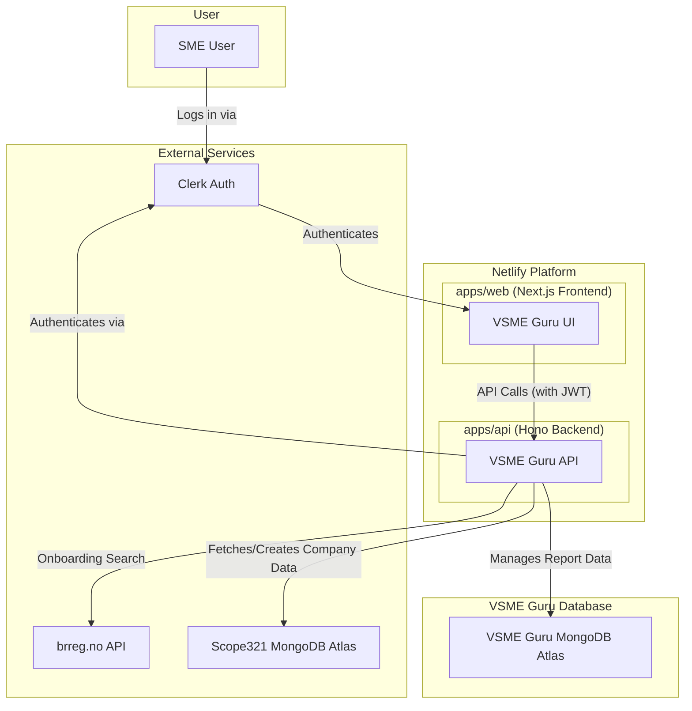

# VSME Guru Architecture - Introduction & High-Level Architecture

**Source:** Architecture Document Sections 1-2  
**Version:** 1.0  
**Date:** August 19, 2025  
**Author:** Winston, Architect

## Introduction

### Purpose
This document outlines the complete full-stack architecture for the VSME Guru application. It translates the requirements from the Project Brief and PRD into a concrete technical plan.

### Role
This document serves as the **single source of truth** for all technical decisions and will be the primary guide for AI developer agents during the implementation phase.

### Design Principles
The architecture is designed to be:
- **Modern:** Using current best practices and technologies
- **Scalable:** Built for growth and increased usage
- **Secure:** Following security best practices
- **Maintainable:** Easy to understand and modify
- **Developer Experience:** Strong emphasis on developer productivity
- **Type Safety:** End-to-end type safety across the entire system

## High-Level Architecture

### System Type
VSME Guru is a **multi-tenant SaaS application** built on a modern, serverless-first architecture.

### Architectural Approach
- **Decoupled Frontend/Backend:** Separate frontend and backend applications
- **Monorepo Management:** Managed within a Turborepo monorepo
- **Code Sharing:** Maximum code sharing and development efficiency
- **Type Safety:** Shared types across frontend and backend

### External Service Dependencies
The system is designed around three critical external services:

1. **Clerk:** Authentication and user management
2. **brreg.no API:** Company data and registration information
3. **Scope321 MongoDB Atlas:** Existing database for company profiles

### Platform Choice
**Netlify** is the chosen hosting and deployment platform, allowing for consolidation with existing applications.

### Architectural Style
- **Frontend:** Next.js application
- **Backend:** Hono API running on Netlify Functions
- **Deployment:** Serverless-first approach

## System Diagram

### Visual Representation

### Data Flow Explanation

#### Authentication Flow
1. **User Login:** SME user logs in via Clerk authentication
2. **Authentication:** Clerk authenticates the user
3. **Session:** User session is established with VSME Guru UI

#### API Communication
1. **Frontend Requests:** VSME Guru UI makes API calls with JWT tokens
2. **Backend Processing:** VSME Guru API processes requests
3. **Token Validation:** API validates JWT tokens via Clerk

#### External Data Integration
1. **Company Search:** API searches company data via brreg.no API
2. **Company Profile:** Fetches or creates company profiles in Scope321 database
3. **Report Data:** Manages VSME-specific reporting data in dedicated database

## Key Architectural Decisions

### 1. Monorepo Approach
- **Benefit:** Shared types and code between frontend and backend
- **Tool:** Turborepo for high-performance monorepo management
- **Result:** Simplified development and deployment

### 2. Serverless Architecture
- **Platform:** Netlify Functions for backend scalability
- **Benefit:** Automatic scaling and reduced operational overhead
- **Framework:** Hono for lightweight, high-performance API development

### 3. Dual Database Strategy
- **Scope321 Database:** Company and user profile data (existing)
- **VSME Guru Database:** VSME-specific reporting data (new)
- **Benefit:** Leverages existing infrastructure while maintaining separation of concerns

### 4. Type Safety
- **Language:** TypeScript across entire stack
- **ORM:** Prisma for database type generation
- **Result:** End-to-end type safety from database to frontend

## System Characteristics

### Scalability
- **Serverless:** Automatic scaling based on demand
- **Database:** MongoDB Atlas for horizontal scaling
- **CDN:** Netlify's global CDN for content delivery

### Security
- **Authentication:** Clerk-managed JWT authentication
- **Authorization:** Route-level protection
- **Data Encryption:** MongoDB Atlas encryption at rest and in transit

### Reliability
- **Platform:** Netlify's proven infrastructure
- **Database:** MongoDB Atlas with automatic backups
- **Monitoring:** Built-in monitoring and alerting

### Maintainability
- **Clear Separation:** Frontend and backend clearly separated
- **Feature-Based Structure:** Co-located related functionality
- **Shared Types:** Single source of truth for data models

## Integration Points

### Authentication Integration
- **Provider:** Clerk
- **Method:** JWT tokens
- **Scope:** All API endpoints
- **Management:** Automatic token refresh and validation

### External API Integration
- **brreg.no API:** Company registration data
- **Error Handling:** Graceful fallback to manual entry
- **Rate Limiting:** Respectful API usage

### Database Integration
- **Scope321 Database:** Read/write access for company profiles
- **VSME Guru Database:** Dedicated reporting data storage
- **ORM:** Prisma for type-safe database operations

## Next Steps

### Immediate Actions
1. **Review Architecture:** Product Owner review for business alignment
2. **Technical Validation:** Development team review for implementation feasibility
3. **Dependency Setup:** Technology stack and development environment setup

### Implementation Planning
1. **Backlog Creation:** Break down features into implementable tasks
2. **Sprint Planning:** Begin development planning with confidence in technical foundation
3. **Team Coordination:** Align development team on architectural approach

### Success Criteria
- **Business Alignment:** Architecture supports all PRD requirements
- **Technical Feasibility:** Implementation approach is achievable
- **Team Confidence:** Development team ready to begin implementation 