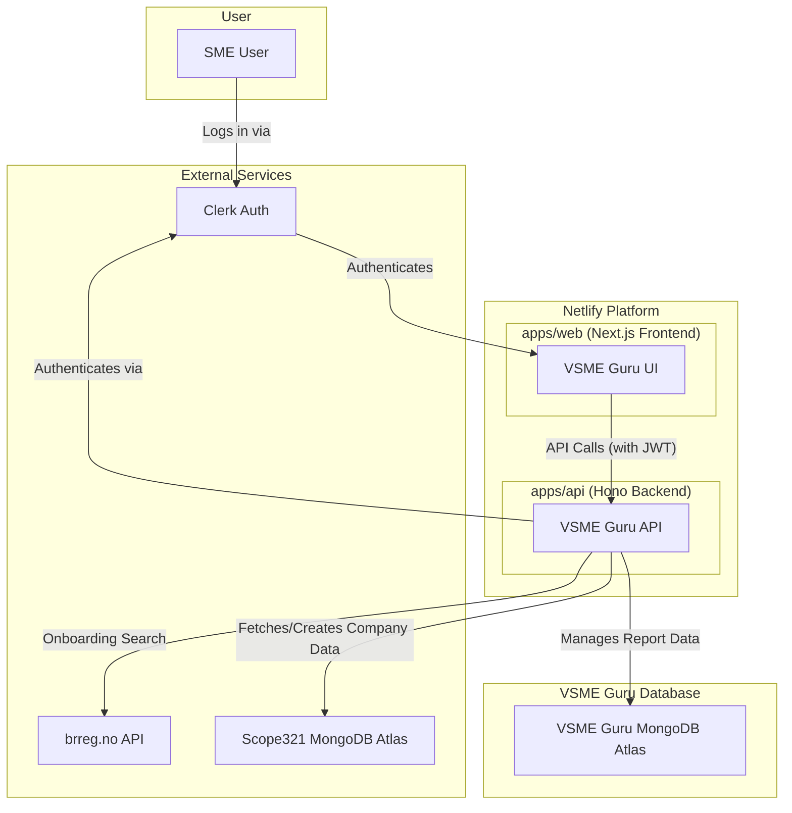

# Full-Stack Architecture Document: VSME Guru

**Author:** Winston, Architect
**Date:** August 19, 2025
**Version:** 1.0
**Status:** Final

## 1. Introduction

This document outlines the complete full-stack architecture for the VSME Guru application. It translates the requirements from the Project Brief and PRD into a concrete technical plan. This document serves as the single source of truth for all technical decisions and will be the primary guide for the AI developer agents during the implementation phase.

The architecture is designed to be modern, scalable, secure, and maintainable, with a strong emphasis on developer experience and end-to-end type safety.

## 2. High-Level Architecture

The VSME Guru is a multi-tenant SaaS application built on a modern, serverless-first architecture. It features a decoupled frontend and backend managed within a monorepo for maximum code sharing and development efficiency. The system is designed around three critical external services: Clerk for authentication, the `brreg.no` API for company data, and an existing MongoDB Atlas database for the "Scope321" application.

*   **Platform:** **Netlify** is the chosen hosting and deployment platform, allowing for consolidation with existing applications.
*   **Architectural Style:** A **decoupled frontend/backend** approach, managed within a **Turborepo monorepo**. The frontend is a Next.js application, and the backend is a Hono API running on Netlify Functions.

### 2.1. System Diagram



## 3. Technology Stack

The following technologies are the definitive choices for this project. All development must adhere to this stack.

| Category | Technology | Version / Spec | Rationale |
| :--- | :--- | :--- | :--- |
| **Platform** | Netlify | Latest | Consolidates hosting with existing apps; excellent support for our stack. |
| **Repository** | Turborepo | Latest | High-performance monorepo for simplified code/type sharing. |
| **Runtime** | Node.js | 20.x (LTS) | Standard, stable, and performant JavaScript runtime. |
| **Frontend** | Next.js | 14+ (App Router) | Leading React framework for performance and developer experience. |
| **Backend** | Hono | Latest | High-performance, lightweight framework ideal for serverless functions. |
| **Language** | TypeScript | Latest | Ensures end-to-end type safety across the entire monorepo. |
| **UI Library** | shadcn/ui | Latest | Composable and accessible components that work perfectly with Tailwind. |
| **Styling** | Tailwind CSS | Latest | Utility-first CSS for rapid and consistent UI development. |
| **Database** | MongoDB Atlas | Latest | Leverages existing team expertise; flexible schema for evolving needs. |
| **ORM** | Prisma | Latest | Provides end-to-end type safety from database to frontend. |
| **Data Fetching** | TanStack Query | v5 | Industry standard for server state management in React. |
| **Forms** | TanStack Form | Latest | Headless, performant form library for complex forms. |
| **Validation** | Zod | Latest | TypeScript-first schema validation for frontend and backend. |
| **Linting** | ESLint | Latest | Industry standard for code quality with a rich plugin ecosystem. |
| **Formatting** | Prettier | Latest | Opinionated code formatter for consistent style. |

## 4. Repository & Code Structure

The project will be organized as a Turborepo monorepo to facilitate code sharing and maintain a single source of truth for types and configurations.

### 4.1. Root Structure

```
/
├── apps/
│   ├── api/          # Hono Backend Application
│   └── web/          # Next.js Frontend Application
├── packages/
│   ├── shared-types/ # Generated Prisma types, Zod schemas
│   └── ui/           # (Optional) Shared React components
├── .eslintrc.js      # Root ESLint config
├── prettier.config.js  # Root Prettier config
└── netlify.toml      # Netlify deployment configuration
```

### 4.2. Backend (`apps/api`) Structure

The Hono backend will follow a feature-based ("co-location") structure for maintainability.

```
apps/api/src/
└── features/
    ├── company/
    │   ├── company.controller.ts  # Hono route definitions
    │   └── company.service.ts     # Business logic
    ├── reports/
    │   ├── report.controller.ts
    │   ├── report.service.ts
    │   └── pdf.generator.ts       # PDF generation logic
    └── prisma/
        └── schema.prisma          # Single source of truth for DB schema
```

### 4.3. Frontend (`apps/web`) Structure

The Next.js frontend will also follow a feature-based structure, co-locating components with the pages that use them.

```
apps/web/src/app/
└── (dashboard)/
    ├── dashboard/
    │   └── page.tsx
    ├── reports/
    │   ├── page.tsx
    │   └── components/
    │       └── report-list.tsx
    └── report/[year]/
        ├── environment/
        │   ├── page.tsx
        │   └── components/
        │       └── environment-module-form.tsx
        └── layout.tsx
```

## 5. Data Architecture

The project will use a **Unified Company Directory Model**.

*   **Scope321 MongoDB Atlas:** This database is the **single source of truth for all `company` and `user` profile data**. The VSME Guru API will create and fetch company profiles directly from this database.
*   **VSME Guru MongoDB Atlas:** This database is dedicated solely to storing **VSME-specific reporting data**. Each document will be linked to a company ID from the Scope321 database and a reporting year.
*   **Prisma:** Prisma will be used as the ORM to manage both database connections. The `schema.prisma` file will define all models, and the auto-generated Prisma Client will provide a fully type-safe interface for all database operations.

## 6. API Contract

The Hono backend will expose the following RESTful API. All endpoints are authenticated via a Clerk JWT sent in the `Authorization: Bearer <token>` header.

*   `GET /api/company`: Fetches the company profile from the Scope321 DB.
*   `POST /api/company`: Creates a new company profile in the Scope321 DB after `brreg.no` onboarding.
*   `GET /api/reports`: Fetches a summary list of all reports for the company.
*   `GET /api/reports/{year}`: Fetches all data for a specific report year from the VSME Guru DB.
*   `PUT /api/reports/{year}/{section}`: Saves/updates data for a specific section of a report in the VSME Guru DB.
*   `POST /api/reports/{year}/generate`: Triggers the asynchronous PDF generation process.
*   `GET /api/jobs/{jobId}`: Checks the status of a PDF generation job.
*   `GET /api/reports/{year}/download`: Downloads the generated PDF report.

## 7. Developer Experience & Tooling

To ensure high-quality, consistent code, the following tools will be enforced across the monorepo:

*   **Linting & Formatting:** A shared configuration for **ESLint** and **Prettier** will be enforced.
*   **Pre-commit Hooks:** **Husky** will be used to automatically run linting and formatting checks before any code is committed, preventing errors and style inconsistencies.

## 8. Deployment & Infrastructure

*   **Platform:** The entire application will be deployed to **Netlify**.
*   **Configuration:** A `netlify.toml` file in the root of the Turborepo will define the build and deployment settings for both the `web` and `api` applications.
*   **CI/CD:** Deployment will be automated. A push to the `main` branch will trigger a new production deployment on Netlify.

## 9. Next Steps

This architecture document provides a complete technical blueprint for the VSME Guru application. The next phase of the project is to move into planning and execution.

1.  **Product Owner (PO) Review:** The PO will review this document alongside the PRD to ensure perfect alignment between business requirements and the technical plan.
2.  **Backlog Creation:** The PO and Scrum Master (SM) will break down the features defined in the PRD into epics and user stories, using the technical details from this document to inform the tasks.
3.  **Sprint Planning:** The development team can begin sprint planning, confident that a solid, well-defined technical foundation is in place.